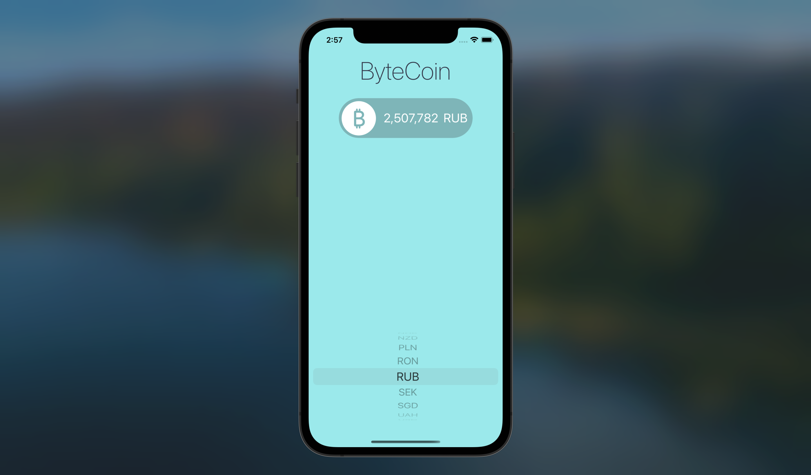

# iOS-ByteCoin
A real-time Bitcoin-to-currency converter for iOS.

The app uses Coinapi.io API for fetching the real-time conversion rate. The interface is created using Swift UIKit and employs the MVC software design pattern.

Available for iOS 13.0 and later.

